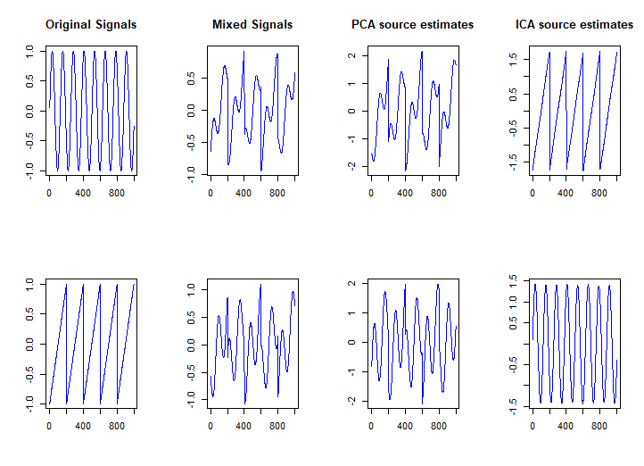

# ICA
Independent Component Analysis

### R code
#use fastICA Package
library(fastICA)

#simulate two independent uniforms and mix them 
S <- matrix(runif(10000), 5000, 2)
A <- matrix(c(1, 1, -1, 3), 2, 2, byrow = TRUE)
X <- S %*% A

#run fastICA algorithm to recover original independent variables
a <- fastICA(X, 2, alg.typ = "parallel", fun = "logcosh", alpha = 1, 
             method = "C", row.norm = FALSE, maxit = 200, 
             tol = 0.0001, verbose = TRUE)

#plot results
par(mfrow = c(1, 4))
plot(S,main = "original data",xlab = "S1", ylab = "S2",col="blue")
plot(a$X, main = "mixed data",xlab = "X1", ylab = "x2",col="blue")
plot(a$X %*% a$K, main = "PCA components",xlab = "PC1", ylab = "PC2",col="blue")
plot(a$S, main = "ICA components",xlab = "IC1", ylab = "IC2",col="blue")

#simulate two independent signals and mix them
Y <- cbind(sin((1:1000)/20), rep((((1:200)-100)/100), 5))
Z <- matrix(c(2.3, 1.3, 3.3, 4.3), 2, 2)
X <- Y %*% Z

#run fastICA algorithm to recover original independent variables
a <- fastICA(X, 2, alg.typ = "parallel", fun = "logcosh", alpha = 1, 
             method = "R", row.norm = FALSE, maxit = 200, 
             tol = 0.0001, verbose = TRUE)

#plot results
par(mfcol = c(2, 4))
plot(1:1000, Y[,1 ], type = "l", main = "Original Signals",
     xlab = "", ylab = "",col="blue")
plot(1:1000, Y[,2 ], type = "l", xlab = "", ylab = "",col="blue")
plot(1:1000, X[,1 ], type = "l", main = "Mixed Signals", 
     xlab = "", ylab = "",col="blue")
plot(1:1000, X[,2 ], type = "l", xlab = "", ylab = "",col="blue")
plot(1:1000, a$X %*% a$K[,1 ], type = "l", main = "PCA source estimates", 
     xlab = "", ylab = "",col="blue")
plot(1:1000, a$X %*% a$K[, 2], type = "l", xlab = "", ylab = "",col="blue")
plot(1:1000, a$S[,1 ], type = "l", main = "ICA source estimates", 
     xlab = "", ylab = "",col="blue")
plot(1:1000, a$S[, 2], type = "l", xlab = "", ylab = "",col="blue")
